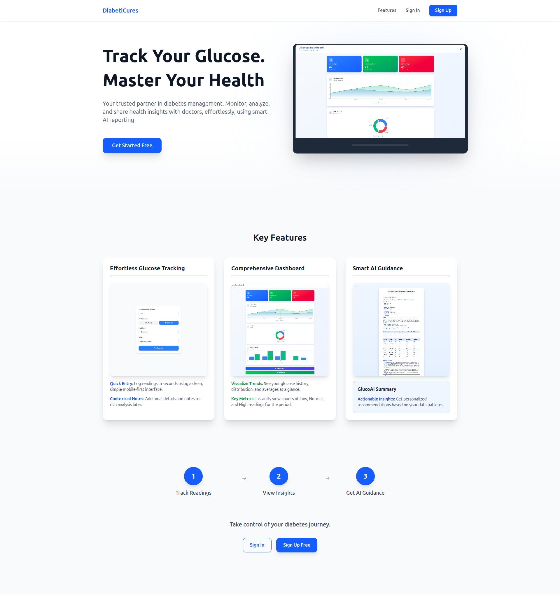
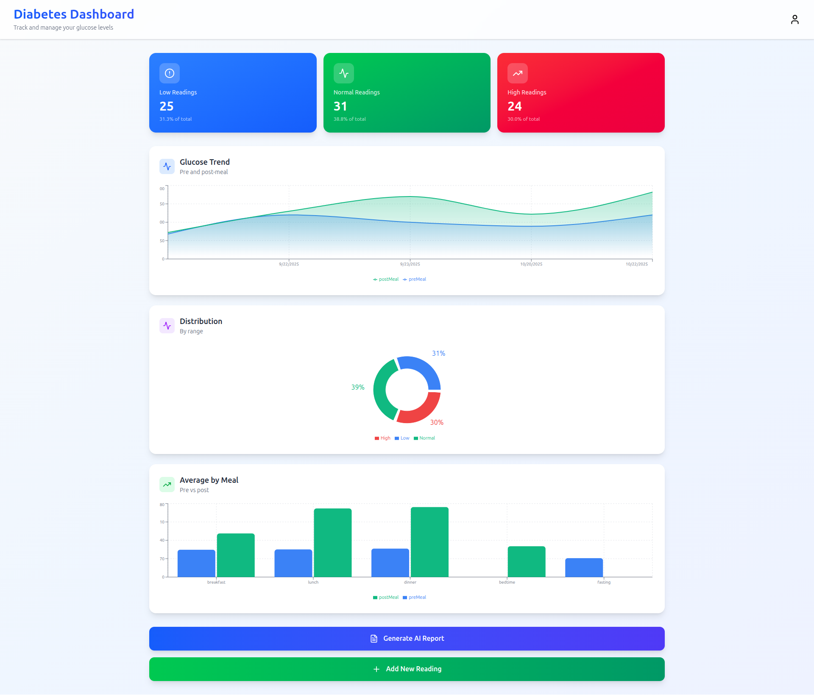
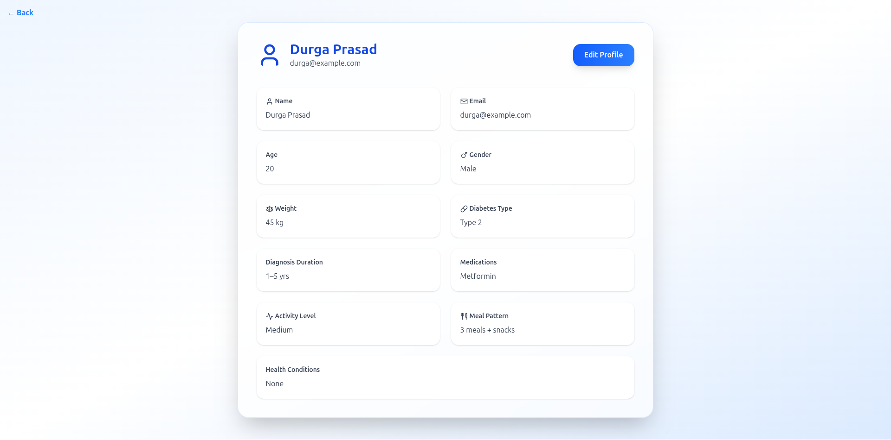
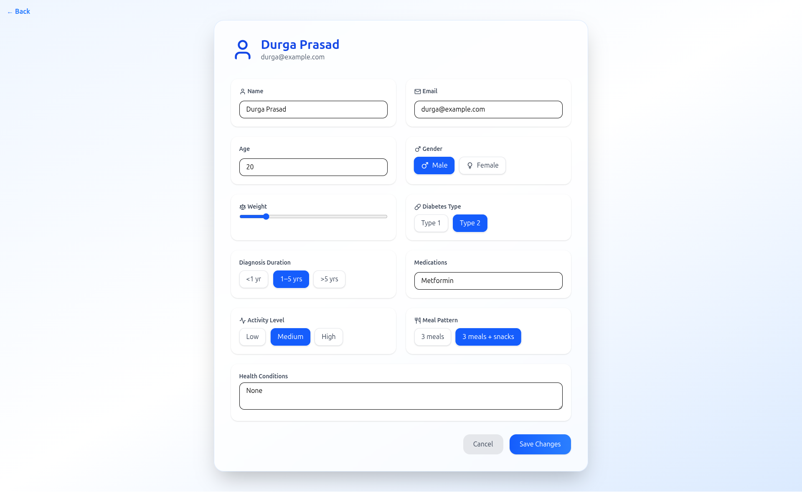
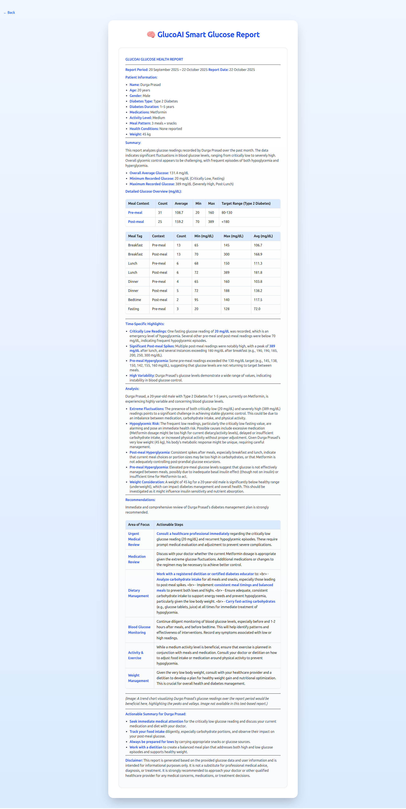
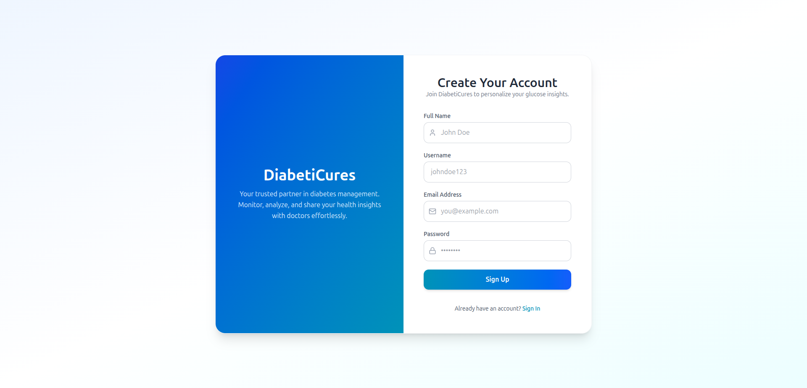
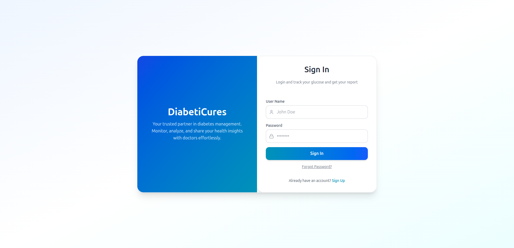

# Diabetic Cure WebApp 



**Diabetic Cure** is a full-stack web application designed to help users monitor and manage their glucose levels efficiently. The platform provides personalized AI-generated reports, dashboards, and insights for better health management.  

---

## Deployment and testing 
**Deployed Line:** [Diabet Cure](https://diabet-cure.vercel.app/landingpage)

**Testing Credentials**
```bash
    {
  "name": "Durga Prasad",
  "userName": "durga123",
  "email": "durga@example.com",
  "password": "StrongP@ssw0rd"
}
```

## Table of Contents
- [Features](#features)
- [Screenshots](#screenshots)
- [Tech Stack](#tech-stack)
- [Installation](#installation)
- [Usage](#usage)

---

## Features

- **AI Glucose Reports:** Generates detailed, doctor-friendly glucose reports based on user data.  
- **User Dashboard:** Visualize glucose levels, meal contexts, and trends.  
- **Profile Management:** Users can set up and update their profile and health details.  
- **Authentication:** Secure sign-up, login, and forgot password functionality.  
- **Responsive UI:** Works seamlessly on mobile and desktop devices.

---

## Screenshots

### Landing Page


### Dashboard


### Profile


### Profile Setup


### AI Report


### Sign Up


### Sign In


---

## Tech Stack

- **Frontend:** React, Tailwind CSS 
- **Backend:** Node.js, Express.js, MongoDB  
- **Authentication:** JWT 
- **AI Integration:** Gemini 2.5-flash for glucose report generation  
- **State Management:** Redux Toolkit  

---

## Installation

Follow these steps to run the project locally:

1. **Clone the repository**
```bash
git clone https://github.com/Durgaprasad-Developer/Diabet-Cure
cd diabetic-cure
```

2. **Install frontend dependencies**
```bash
cd client
npm install
```

3. **Install backend dependencies**
```bash
cd Server
npm install
```

4. **Setup environment variables**
Create a .env file in the root of your backend folder:
```bash
PORT=8000
MONGO_URI=your_mongodb_connection_string
OPENAI_API_KEY=your_openai_api_key
JWT_SECRET=your_jwt_secret
```

5. **Run the application**
```bash
# Backend
npm run dev

# Frontend (in a separate terminal)
cd ../frontend
npm start
```
The app should now be running at http://localhost:8000.

## Usage

1. Sign up or log in with your credentials.

2. Fill in your profile details and health information.

3. Add your glucose readings manually or via supported devices.

4. View your dashboard to monitor trends and insights.

5. Generate AI-powered glucose reports anytime.

